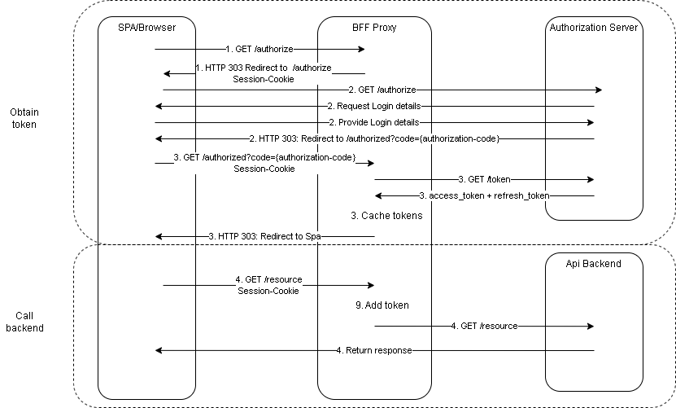
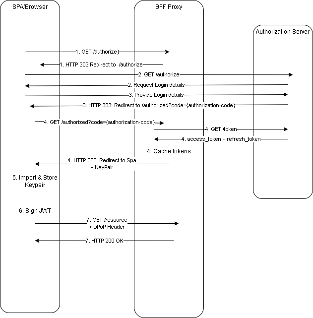

# Azure Api management & OAuth 2.0 for Browser-Based Apps

## Single Page Applications

Single Page Applications (Spa) rely on a single webpage that is dynamically rewritten by client side scripting.
They deliver a more native experience by providing faster transitions without loading new pages.
Typically, Spas interact with the backend data model using REST Apis. 
These interactions often require the browser to keep track of OAuth 2.0 Access Tokens for authorizing requests.

This results in several challenges:
- The frontend must implement all interactions with authorization server(s).
- Apis require public OAuth clients, enabling client impersonation.
- OAuth 2.0 access tokens are stored insecurely in the browser application, which introduces security risks.
- Apis may become vulnerable to client-side attacks like Protocol Downgrade, Cross Site Scripting (Xss) and Cross Site Request Forgery (Csrf).

The above issues can be resolved by implementing a [Backend For Frontend (Bff) proxy](https://datatracker.ietf.org/doc/html/draft-ietf-oauth-browser-based-apps#name-single-domain-browser-based) or [Token Handler Pattern](https://curity.io/resources/learn/the-token-handler-pattern/).

## Security
Single Page Applications require some thought about security details.

### Cross-Site Scripting
Cross-site scripting (Xss) attacks rely on on the injection of malicious client-side code.
The application executes this code, which allows an attacker to:

- Perform Http requests to trusted domains, to obtain secured data or to perform a malicious operation.
- Read local-storage, indexedDb and cookies, to obtain session tokens and secure data.
- Perform Http requests to untrusted domains, to store stolen data.

An attacker can thus abuse an authentic session between the browser and the Apis, and perform any operation for the duration of the browser session.
Furthermore, if an injected script manages to capture session tokens, access tokens or refresh tokens, they can be forwarded to the attacker.
The attacker can then even hijack the session and continue the abuse outside the original browser application.

Preventing Xss is mainly a responsibility of the developer.
However, [Content Security Policy (CSP)](https://content-security-policy.com/) headers provide a second line of defense against Xss.
They allow detailed specification of valid locations for scripts and content.
They can also prevent framing attacks and protocol downgrade attacks.

Using `HttpOnly` cookies to manage the session between browsers and Apis limits the consequences of Xss attacks.
Although the attacker can still perform Api requests, the session token itself is not accessible.
The attacker can thus not steal the session, and keep it alive after the browser session is closed.

### Cross-Site Request Forgery

Cross-Site Request Forgery (CSRF) attacks abuse authentic session between browsers and Apis that rely on cookies or other cached credentials.
The attacker performs Api requests to an authentic Api, from a malicious website. 
Since the browser caches the credentials or cookies for the domain of the Api, the request succeeds.
The malicious site can forward this information to the attacker, or perform transactions using the authentic session.
There are multiple ways to prevent CSRF attacks.

First, the [same-origin policy](https://en.wikipedia.org/wiki/Same-origin_policy) disallows requests from a page from origin A to origin B with a different protocol, port, or host.
CORS loosens these restrictions by introducing a preflight `OPTIONS` request to origin B, before performing the actual request.
The response of the preflight request contains an `Access-Control-Allow-Origin` header that includes the allowed origins.
If the header contains a wildcard `*` or origin A, the request is allowed.
Otherwise, the request is blocked.
This mechanism prevents that malicious websites can abuse an authentic Api.
The Bff proxy required CORS policies when the Spa is hosted at a different domain.
If a backend does not implement CORS policies itself, Api Management can implement these details.
Azure Api management provides the CORS [policy](https://learn.microsoft.com/en-us/azure/api-management/cors-policy) to process the pre-request.

Alternatively, Apis can use [CSRF tokens](https://brightsec.com/blog/csrf-token/) to prevent CSRF attacks.
After session initialization, the Api generates a random CSRF token and stores this in the session (for instance using a `HttpOnly` cookie).
The CSRF token is also returned to the application, and stored in a location that can only be accessed by the application.
The application includes the CSRF token in each subsequent request to the Api, where it is checked against the value in the session.
The Api blocks a request when the CSRF token from the session does not match the value that was padded in the request.
This protects the Api against CRSF attacks, since the malicious website cannot retrieve the CSRF token from the authentic application.

## Hosting the Spa
The Spa consists of a html page that uses Javascript to dynamically load content from different domains.
This may results in some challenges:
- CSP headers must be properly initialized for all domains.
- Modern browsers do not support third party cookies for managing browser sessions for Apis.
- The CORS policies may have to be configured to allow requests from the Spa.

Exposing this page through an Api Management solution provides the following advantages:
- The Spa can use First Party cookies to manage the session with Apis.
- Api Management policies can implement Content Security Policy (CSP) by generating and setting a nonce in the script body and in the `Content-Security-Policy` Http header. This acts as a second line of defense for Cross-Site Scripting (Xss) attacks.
- No CORS policies need to be configured, since all requests run through one origin.

**_NOTE_** Solutions like Azure Static Sites introduce [backend apis](https://learn.microsoft.com/en-us/azure/static-web-apps/add-api?tabs=vanilla-javascript), to host apis within the same domain as the website itself. This resolves the issues with CORS and third party cookies, but does not provide provide a mechanism to dynamically add nonces for CSP headers.

## Backend For Frontend proxy using HttpOnly cookies

Instead of directly connecting to the data model backend, all requests to backend Apis run through the Bff proxy.
Here, the connection between the browser and the Bff proxy relies on a session cookie.
This session cookie contains the `HttpOnly`, `MaxAge` and `Secure` attributes, to make sure that scripts cannot extract the session token, prevent protocol downgrade attacks, and provide a session timeout mechanism.

The Bff pattern can be implemented stateless or stateful.
The stateless variant encrypts all relevant oauth information (access tokens, refresh tokens, code verifiers) and stores it in the [session token](https://learn.microsoft.com/en-us/azure/api-management/howto-protect-backend-frontend-azure-ad-b2c).
This approach limits storage requirements on the Bff proxy.
However, it increases request and response sizes, and requires a policy for encryption key rotation.
The stateful variant caches all relevant oauth information in the proxy, and uses a smaller randomized session token.

Azure Api Management is a suitable platform for implementing a Bff:
- It supports policies to implement Access Token and session cookie management.
- It supports internal caching of access token and refresh token.
- It allows additional logic to be added to Api calls, for instance for implementing [CSRF tokens](https://cheatsheetseries.owasp.org/cheatsheets/Cross-Site_Request_Forgery_Prevention_Cheat_Sheet.html).
- It is a scalable service that allows for high throughput.

This post implements a stateful variant of the Bff pattern in Azure Api Management, where it uses Azure Active Directory for authorizing requests to backend Apis.

## Implementing the Bff using HttpOnly cookies

The Bff proxy is a confidential OAuth 2.0 client that is responsible for managing all access tokens.
For each inbound request, it translates the session cookie the right OAuth 2.0 access token.
For this, Api Management requires a confidential `client-id` and `client-secret`.
The request flow is shown in the figure below:

First, Api Management exposes an `/authorize` endpoint for retrieving authorization codes from Azure Active Directory.
This endpoint requires the following [oauth parameters](https://www.oauth.com/oauth2-servers/authorization/the-authorization-request/):
- scope 
- response_type
- nonce 
- state 

Api Management forwards the browser to the Azure Active Directory authorization endpoint using Http response code `303 See Other`. 
Furthermore, it generates a random session token and places it in the `Session-Token` cookie.
Finally, it adds the `client_id`, `code_challenge_method`, `code_challenge` and `response_mode` OAuth parameters to the redirect uri.

The user must now finish the login process for Azure Active Directory in the browser. 
Response mode is `query` by default, but `fragment` is also supported to immediately retrieve de OpenId token.
However, this approach requires a Http `POST` operation instead of a `GET`.
After a successful login, the authorization server redirects the browser to Api Management.
Here, Api Management retrieves the authorization code, and requests the corresponding `access_token` and `refresh_token`.
Api Managements caches the tokens and redirects the browser back to the Spa, the cache duration matches the token lifetimes.
The caching keys contain a combination of the `Session-Token`, the `scope`, and the type of token.

After processing the redirect, the browser may perform a request to the backend Api through Api Management.
The browser must add the `scope` parameters to this request.
The Bff proxy uses a [policy fragment](https://learn.microsoft.com/en-us/azure/api-management/policy-fragments) that implements the following decision tree to obtain tokens:
1. If an access token is present in the cache with the same `Session-Token` and `scope`, return it.
2. If a refresh token is present in the cache with the same `Session-Token` and `scope`, request a new access token and return it.
3. return an `Unauthorized` exception.

## Backend For Frontend proxy using Demonstrating Proof of Possession tokens

A downside of cookie based sessions is the requirement for first-party cookies. 
This requires the Bff proxy to be hosted at the same domain as the Spa.
A solution for this approach is to use Demonstrated Proof of Possession (DPoP) tokens.
The corresponding flow is shown below:

The DPoP approach replaces the `Session-Token` with the public key of a server-generated key-pair.
This BFF proxy returns the key-pair through an URI fragment in the redirect URI.
The application imports the key-pair in a non-extractable [CryptoKeyPair](https://developer.mozilla.org/en-US/docs/Web/API/CryptoKeyPair) object instance, clears the Uri fragment, and persists it in IndexedDB.
The object instance can be used to sign data, but the private key is inaccessible for client code.
Thus, Xss attacks can still perform malicious requests, but they cannot steal the browser session.

**_NOTE_** It is also possible to let the browser generate a key-pair, but this allows an Xss attacker to import a known key-pair. This would allow the attacker to steal the session.

After processing the redirect, the browser may perform a request to the backend Api through Api Management.
The browser must add the `scope` parameter and `DPop` header to this request.
The DPoP header contains a JWT that is signed by the key-pair in IndexedDB.
It contains the following claims:

- `jti`: Unique identifier for the request.
- `htm`: Http method of the request
- `htu`: target uri of the request
- `iat`: creation timestamp of the JWT

The Bff proxy performs the following checks:
- `htm` & `htu` match the request
- `iat` is within an acceptable range of time. 
- `jti` has not been used already. 

The `jti` claim is cached for the duration of at least the acceptable window of the `iat`.

## Conclusion

A Bff proxy can help in simplifying the implementation of a Spa.
The most challenging aspect of building a Bff is session management.
This entails a browser contained secret that is passed to the Bff proxy during each request, but is not accessible by client side scripts.
This can either be achieved using `HttpOnly` cookies, or using key-pairs.

When using cookie-based sessions, Apis must be hosted at the same domain as the static content of the application.
Also, CSRF tokens or tight CORS policies must be used to prevent CSRF attacks, since a `HttpOnly` cookie is also send for requests from outside the application.

Key-pair driven sessions allow Apis to be hosted at different domains, since the session-state is transmitted using Http headers
Moreover, they are less prone to CSRF issues.
However, attackers may target the redirect mechanism that is triggered after authorization, to obtain the private key.
Alternatively, browser generated key-pairs are vulnerable to being replaced with malicious imported key-pairs from an Xss attacker.
This last option would result is full theft of the session.
Finally, it is hard to fully prevent reuse of DPoP JWT tokens, since Bff proxies are often implemented as a distributed system and cached values take a small time to become available.

